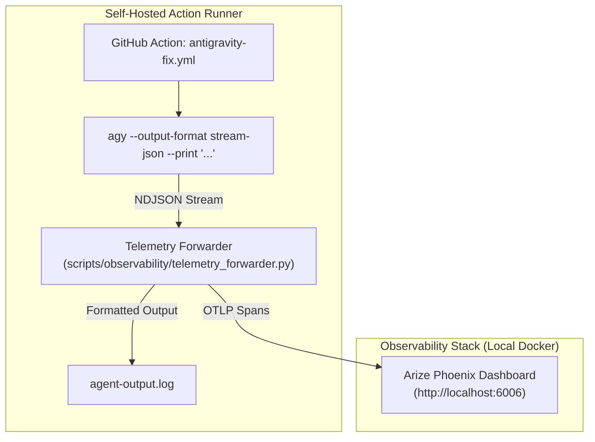

# Research: Agentic Observability for Antigravity Runner (`agy`)

## 1. Executive Summary

Investigated primary sources for Google Antigravity CLI (`agy`) and leading open-source agent observability platforms (**Arize Phoenix**, **Langfuse**, **OpenLIT**). Verified runtime telemetry schemas via live CLI runs (`agy --output-format stream-json`, `transcript.jsonl`, and `hooks.json`).

**Core Recommendation:**
Use **Method B: Real-Time `stream-json` Pipeline** forwarding OpenTelemetry (OTLP/OpenInference) spans to **Arize Phoenix** (`http://localhost:6006`) or **Langfuse** (`http://localhost:3000`). It captures exact tool parameters, outputs, durations, token usage, and LLM thinking tokens without blocking agent execution loops.

---

## 2. Primary Source Findings

### A. Antigravity CLI (`agy`) Capabilities
- **CLI Reference & Help Flag (`agy --help`):**
  - `--output-format stream-json`: Emits newline-delimited JSON (NDJSON) events live to stdout.
  - `--dangerously-skip-permissions`: Auto-approves tool requests for autonomous CI/CD.
  - `--print` / `-p`: Non-interactive single-prompt execution.
  - `--log-file <path>`: Custom log path override.
- **Empirical Event Schema (`stream-json`):**
  - `init`: Emits `conversation_id`, available tools catalog, and working directory.
  - `step_update (agent_response)`: Contains `duration_seconds` and `usage` (`input_tokens`, `output_tokens`, `thinking_tokens`, `total_tokens`).
  - `step_update (tool, state: ACTIVE)`: Contains `tool_name` and `tool_info.parameters` (e.g. `run_command`, `call_mcp_tool`, `stitch_*`).
  - `step_update (tool, state: DONE)`: Contains `duration_seconds`, `tool_info.parameters`, and `tool_info.output`.
  - `result`: Emits total conversation summary, status (`SUCCESS` / `ERROR`), final response text, and aggregate token counts.

### B. Antigravity Lifecycle Hooks (`.agents/hooks.json`)
- **Reference:** `docs/hooks.md` in `agy-customizations` skill.
- **Events:** `PreToolUse`, `PostToolUse`, `PreInvocation`, `PostInvocation`, `Stop`.
- **Payload Schema:**
  - `PreToolUse` (stdin): `{"toolCall": {"name": "...", "args": {...}}, "stepIdx": N, "conversationId": "...", "transcriptPath": "..."}`
  - `PostToolUse` (stdin): `{"stepIdx": N, "error": "...", "conversationId": "..."}`
- **Trade-off:** Hooks run synchronously via `sh -c` and block the agent loop. `PostToolUse` does not include output text or tool names directly; requires local state file correlation.

### C. Persistent Transcript Logs (`transcript.jsonl`)
- **Location:** `~/.gemini/antigravity-cli/brain/<conversation-id>/.system_generated/logs/transcript.jsonl` (and `transcript_full.jsonl`).
- **Content:** Every step (`USER_INPUT`, `PLANNER_RESPONSE`, `GENERIC`), timestamps, model thoughts, tool calls, tool results, and token metrics.

---

## 3. Platform Comparison: Arize Phoenix vs Langfuse vs OpenLIT

| Platform | Primary Transport | Docker Setup | Strengths | Best Fit |
| :--- | :--- | :--- | :--- | :--- |
| **Arize Phoenix** | OTLP/HTTP (`:6006/v1/traces`) | Single container (`arize/phoenix:latest`) | OpenInference standard, zero auth, nested tool spans | Local runner dashboard (<2 min setup) |
| **Langfuse** | OTLP/HTTP (`:3000/api/public/otel/v1/traces`) or REST | Docker Compose (Postgres, ClickHouse, App) | Production agent monitoring, cost analytics, session threads | Shared team server & cloud |
| **OpenLIT** | Pure OpenTelemetry (`:4318/v1/traces`) | Single container or OTel Collector | Direct Grafana/Jaeger routing | Existing enterprise OTel stack |

---

## 4. Integration Architecture



---

## 5. Concrete Implementation

### Step 1: Telemetry Forwarder Script
Save to `scripts/observability/telemetry_forwarder.py`:

```python
#!/usr/bin/env python3
"""
Telemetry forwarder for Antigravity CLI stream-json format.
Transmits spans via OTLP/HTTP to Arize Phoenix or Langfuse.
"""
import os
import sys
import json
from typing import Dict, Any
from opentelemetry import trace
from opentelemetry.trace import Status, StatusCode
from opentelemetry.sdk.trace import TracerProvider
from opentelemetry.sdk.trace.export import BatchSpanProcessor
from opentelemetry.exporter.otlp.proto.http.trace_exporter import OTLPSpanExporter
from opentelemetry.sdk.resources import Resource

PHOENIX_ENDPOINT = os.getenv("PHOENIX_COLLECTOR_ENDPOINT", "http://localhost:6006/v1/traces")
GITHUB_RUN_ID = os.getenv("GITHUB_RUN_ID", "local")
ISSUE_NUMBER = os.getenv("ISSUE_NUMBER", "unknown")

resource = Resource.create({
    "service.name": "antigravity-runner",
    "github.run_id": GITHUB_RUN_ID,
    "github.issue": ISSUE_NUMBER,
})
provider = TracerProvider(resource=resource)
exporter = OTLPSpanExporter(endpoint=PHOENIX_ENDPOINT)
provider.add_span_processor(BatchSpanProcessor(exporter))
tracer = trace.get_tracer("antigravity-runner")

active_spans: Dict[int, Any] = {}
root_span = None

for line in sys.stdin:
    line = line.strip()
    if not line:
        continue
    try:
        data = json.loads(line)
    except json.JSONDecodeError:
        continue

    event_type = data.get("event")

    if event_type == "init":
        conv_id = data.get("conversation_id")
        root_span = tracer.start_span(f"agy-conversation-{conv_id}")
        root_span.set_attribute("openinference.span.kind", "AGENT")
        root_span.set_attribute("agent.conversation_id", conv_id)
        root_span.set_attribute("agent.cwd", data.get("init", {}).get("cwd", ""))

    elif event_type == "step_update":
        step = data.get("step_update", {})
        idx = step.get("step_index")
        state = step.get("state")
        step_type = step.get("step_type")

        # LLM Reasoning & Tokens
        if step_type == "agent_response" and state == "DONE":
            usage = step.get("usage", {})
            gen_span = tracer.start_span(f"step_{idx}_llm_generation")
            gen_span.set_attribute("openinference.span.kind", "LLM")
            gen_span.set_attribute("llm.token_count.prompt", usage.get("input_tokens", 0))
            gen_span.set_attribute("llm.token_count.completion", usage.get("output_tokens", 0))
            gen_span.set_attribute("llm.token_count.total", usage.get("total_tokens", 0))
            gen_span.set_attribute("duration_seconds", step.get("duration_seconds", 0))
            gen_span.end()

        # Tool Call Started
        elif step_type == "tool" and state == "ACTIVE":
            tool_name = step.get("tool_name", "unknown")
            params = step.get("tool_info", {}).get("parameters", {})
            span = tracer.start_span(f"tool_{tool_name}")
            span.set_attribute("openinference.span.kind", "TOOL")
            span.set_attribute("tool.name", tool_name)
            span.set_attribute("input.value", json.dumps(params))
            if "mcp" in tool_name.lower():
                span.set_attribute("mcp.tool", True)
            active_spans[idx] = span

        # Tool Call Completed
        elif step_type == "tool" and state == "DONE":
            span = active_spans.pop(idx, None)
            if span:
                output = step.get("tool_info", {}).get("output", "")
                span.set_attribute("output.value", str(output))
                span.set_attribute("duration_seconds", step.get("duration_seconds", 0))
                span.set_status(Status(StatusCode.OK))
                span.end()

    elif event_type == "result":
        res = data.get("result", {})
        if root_span:
            root_span.set_attribute("result.status", res.get("status", "SUCCESS"))
            root_span.set_attribute("result.duration_seconds", res.get("duration_seconds", 0))
            root_span.end()
        print(res.get("response", ""))

provider.shutdown()
```

### Step 2: Workflow Update (`.github/workflows/antigravity-fix.yml`)
Add Arize Phoenix container startup and stream piping:

```yaml
      - name: Ensure Arize Phoenix Daemon
        run: |
          if ! docker ps --filter "name=phoenix" --filter "status=running" -q | grep -q .; then
            docker run -d --name phoenix -p 6006:6006 --restart unless-stopped arize/phoenix:latest || true
          fi
          pip install opentelemetry-api opentelemetry-sdk opentelemetry-exporter-otlp-proto-http

      - name: Run Antigravity Agent
        env:
          ISSUE_NUMBER: ${{ github.event.issue.number }}
          ISSUE_TITLE: ${{ github.event.issue.title }}
          ISSUE_BODY: ${{ github.event.issue.body }}
          COMMENT_BODY: ${{ github.event.comment.body }}
          GITHUB_TOKEN: ${{ secrets.GITHUB_TOKEN }}
          PHOENIX_COLLECTOR_ENDPOINT: "http://localhost:6006/v1/traces"
        run: |
          export PATH="$HOME/.local/bin:$PATH"

          agy --output-format stream-json --dangerously-skip-permissions --print "/diagnosing-bugs Resolve issue #$ISSUE_NUMBER: $ISSUE_TITLE.
          Details: $ISSUE_BODY
          Instructions: $COMMENT_BODY

          Repository: expenseSummary
          Tasks:
          1. Write a file named 'pr-summary.md' with root cause and fix verification.
          2. Create branch 'fix/issue-$ISSUE_NUMBER', commit all changes, and push." \
          | python3 scripts/observability/telemetry_forwarder.py 2>&1 | tee agent-output.log
```
